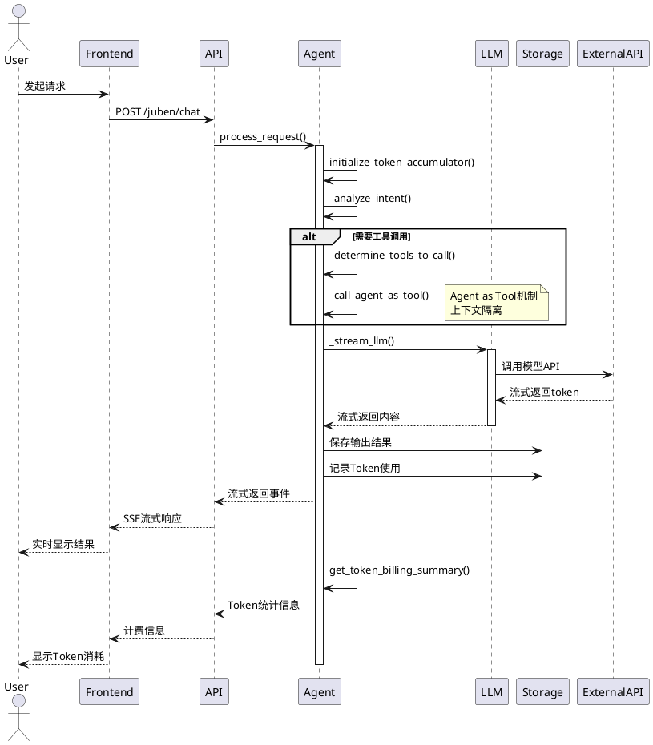

# Agents模块流程分析

## 功能概述

Agents模块是剧本创作平台的核心业务层，包含40+个专业AI智能体，负责处理短剧策划、创作、评估、分析等各种业务场景。每个Agent都是独立的业务单元，通过Agent as Tool机制实现模块化调用和上下文隔离。

## 入口方法

```
agents/base_juben_agent.py:BaseJubenAgent.__init__()
agents/base_juben_agent.py:BaseJubenAgent.process_request()
```

## 方法调用树

```
BaseJubenAgent (基础Agent类)
├─ 初始化流程
│  ├─ __init__()
│  │  ├─ _load_system_prompt() - 加载系统提示词
│  │  ├─ _init_clients() - 初始化LLM客户端
│  │  ├─ _init_notes_manager() - 初始化Notes管理器
│  │  ├─ _init_reference_resolver() - 初始化引用解析器
│  │  ├─ _init_multimodal_processor() - 初始化多模态处理器
│  │  ├─ _init_stop_manager() - 初始化停止管理器
│  │  └─ _init_project_manager() - 初始化项目管理器
├─ 请求处理流程
│  ├─ process_request() - 主处理入口
│  │  ├─ initialize_token_accumulator() - 初始化Token累加器
│  │  ├─ [业务处理] - 子类实现具体业务
│  │  └─ get_token_billing_summary() - 获取计费摘要
│  └─ _stream_llm() - LLM流式调用
│     ├─ _prepare_messages() - 准备消息
│     ├─ get_llm_client() - 获取LLM客户端
│     └─ [流式输出] - 返回生成内容
└─ 工具方法
   ├─ _emit_event() - 发送事件
   ├─ get_agent_info() - 获取Agent信息
   └─ _call_agent_as_tool() - Agent作为工具调用

ShortDramaPlannerAgent (短剧策划Agent)
├─ process_request()
│  ├─ _analyze_intent() - 意图识别
│  ├─ _extract_url_contents() - URL内容提取
│  ├─ _determine_tools_to_call() - 确定调用的工具
│  ├─ _call_agent_as_tool() - 调用工具Agent
│  │  ├─ websearch - 网络搜索
│  │  ├─ knowledge - 知识库查询
│  │  ├─ creator - 创作助手
│  │  └─ file_reference - 文件引用
│  └─ _generate_planning_response() - 生成策划响应
└─ get_agent_info()

StoryFiveElementsAgent (故事五元素分析Agent)
├─ process_request()
│  ├─ _truncate_text() - 文本截断
│  ├─ _split_text() - 文本分割
│  ├─ _batch_process_chunks() - 批处理文本块
│  ├─ _call_sub_agent() - 调用子Agent
│  │  ├─ story_type_analyzer - 题材类型分析
│  │  ├─ story_summary_generator - 故事梗概生成
│  │  ├─ character_profile_generator - 人物小传生成
│  │  ├─ character_relationship_analyzer - 人物关系分析
│  │  └─ plot_points_analyzer - 大情节点分析
│  ├─ _generate_mind_map() - 生成思维导图
│  └─ _compile_final_result() - 整理最终结果
└─ get_agent_info()

PlotPointsWorkflowAgent (情节点工作流Agent)
├─ process_request()
│  ├─ _process_input_validation() - 输入验证
│  ├─ _process_text_preprocessing() - 文本预处理
│  │  ├─ text_truncator.truncate_text() - 截断
│  │  └─ text_splitter.split_text() - 分割
│  ├─ _process_batch_coordination() - 批处理协调
│  ├─ _process_agent_coordination() - Agent协调
│  │  ├─ _call_story_summary_agent() - 故事大纲
│  │  ├─ _call_major_plot_points_agent() - 大情节点
│  │  ├─ _call_mind_map_agent() - 思维导图
│  │  └─ _call_detailed_plot_points_agent() - 详细情节点
│  └─ _process_result_integration() - 结果整合
└─ get_workflow_info()

DramaWorkflowAgent (剧本创作工作流Agent)
├─ process_request()
│  ├─ _call_text_truncator() - 文本截断处理
│  ├─ _call_text_splitter() - 文本分割处理
│  ├─ 并行处理
│  │  ├─ _call_drama_analysis() - 剧情分析
│  │  └─ 批量分析
│  └─ _call_result_integrator() - 结果整合
└─ 工作流状态管理

NovelScreeningEvaluationAgent (小说初筛评估Agent)
├─ process_request()
│  ├─ _process_full_file_branch() - 完整文件分支
│  │  ├─ _truncate_text() - 文本截断
│  │  ├─ _split_text() - 文本分割
│  │  ├─ _batch_process_summary() - 批量总结
│  │  ├─ _batch_evaluate_story() - 批量评估(10轮)
│  │  ├─ _analyze_scores() - 评分分析
│  │  └─ _create_evaluation_document() - 创建文档
│  └─ _process_short_file_branch() - 短文件分支
│     ├─ _truncate_text() - 文本截断
│     ├─ _batch_evaluate_story() - 批量评估(10轮)
│     ├─ _analyze_scores() - 评分分析
│     └─ _create_evaluation_document() - 创建文档
└─ get_workflow_info()

WebSearchAgent (网络搜索Agent)
├─ process_request()
│  ├─ _analyze_intent() - 意图识别
│  ├─ _extract_url_contents() - URL内容提取
│  ├─ _execute_web_search() - 执行网络搜索
│  │  └─ _search_web() - 调用搜索API
│  ├─ _format_search_results() - 格式化结果
│  └─ _generate_search_summary() - 生成搜索总结
└─ get_agent_info()

KnowledgeAgent (知识库查询Agent)
├─ process_request()
│  ├─ _analyze_intent() - 意图识别
│  ├─ _search_knowledge_base() - 知识库搜索
│  │  └─ knowledge_client.search() - 向量检索
│  ├─ _format_knowledge_results() - 格式化结果
│  └─ _generate_knowledge_summary() - 生成知识总结
└─ get_available_collections()
```

## 详细业务流程

### 1. BaseJubenAgent基础流程

**1.1 Agent初始化流程**
```
1. 调用父类(ContextManagementMixin)初始化
2. 加载系统配置(JubenSettings)
3. 初始化日志记录器
4. 配置性能优化参数(thought_streaming, fast_mode等)
5. 初始化Token累加器
6. 初始化性能监控器
7. 初始化Notes管理器
8. 初始化智能引用解析器
9. 初始化多模态处理器
10. 初始化停止管理器
11. 初始化客户端连接池
12. 加载系统提示词
```

**1.2 请求处理流程**
```
1. 接收request_data(包含input、user_id、session_id等)
2. 初始化Token累加器(user_id + session_id)
3. 发送处理开始事件
4. 执行具体业务逻辑(由子类实现)
   - 可能调用其他Agent作为工具
   - 可能进行LLM调用
   - 可能进行批处理
5. 流式输出处理结果
6. 获取Token计费摘要
7. 发送完成事件
8. 清理Token累加器
```

**1.3 LLM流式调用流程**
```
1. 准备消息列表(包含system_prompt和user消息)
2. 获取LLM客户端实例(从连接池)
3. 设置thinking_budget(根据agent类型)
4. 调用LLM API进行流式生成
5. 处理思考过程输出(如果启用)
6. 流式返回生成的token
7. 记录Token使用量
8. 处理异常和重试
```

### 2. ShortDramaPlannerAgent业务流程

**2.1 短剧策划流程**
```
1. 接收用户输入(策划需求)
2. 意图识别分析
   - 使用IntentRecognizer分析用户意图
   - 判断是否需要网络搜索
   - 判断是否需要知识库查询
3. URL内容提取(如果输入包含链接)
4. 工具Agent调用决策
   - 根据意图确定需要调用的工具
   - 检测文件引用(@file1等)
5. 工具Agent并行调用
   - WebSearchAgent: 网络搜索最新市场信息
   - KnowledgeAgent: 查询知识库获取专业资料
   - 其他工具Agent...
6. 构建策划提示词
   - 整合用户需求
   - 添加搜索结果
   - 添加知识库内容
   - 添加URL内容
7. LLM生成策划方案
8. 流式返回结果
9. Token计费统计
```

### 3. StoryFiveElementsAgent业务流程

**3.1 故事五元素分析流程**
```
1. 文本截断处理
   - 调用TextTruncator截断超长文本
   - 默认最大长度50000字符
2. 文本分割处理
   - 调用TextSplitter分割文本
   - 默认chunk_size=10000
3. 批处理文本块
   - 并发生成每个chunk的总结(限制5个并发)
   - 每个chunk超时3分钟
4. 整合批处理结果
   - 拼接所有总结
5. 五个专业子Agent分析
   - 5.1 题材类型与创意提炼(StoryTypeAnalyzerAgent)
   - 5.2 故事梗概生成(StorySummaryGeneratorAgent)
   - 5.3 人物小传生成(CharacterProfileGeneratorAgent)
   - 5.4 人物关系分析(CharacterRelationshipAnalyzerAgent)
   - 5.5 大情节点分析(PlotPointsAnalyzerAgent)
6. 生成思维导图
   - 调用MindMapGenerator生成可视化
7. 整理最终结果
   - 格式化为Markdown
   - 包含思维导图图片和编辑链接
8. Token计费统计
```

### 4. PlotPointsWorkflowAgent业务流程

**4.1 情节点工作流执行流程**
```
1. 输入验证
   - 检查必需参数(input)
   - 设置默认参数(chunk_size, length_size)
2. 文本预处理
   - TextTruncator截断文本
   - TextSplitter分割文本
3. 批处理协调
   - 配置BatchProcessor
   - 设置并行限制(max_parallel_limit=10)
4. Agent并行调用
   - StorySummaryGeneratorAgent: 故事大纲
   - MajorPlotPointsAgent: 大情节点
   - MindMapAgent: 思维导图
   - DetailedPlotPointsAgent: 详细情节点
5. 结果整合
   - 收集所有Agent结果
   - 格式化为统一结构
   - 包含元数据(处理时间、chunk数量等)
6. 发送完成事件
```

### 5. NovelScreeningEvaluationAgent业务流程

**5.1 小说初筛评估流程**
```
1. 输入参数解析
   - file: 完整文件内容
   - short_file: 短文件内容
   - theme: 主题(默认"小说")
2. 分支判断
   - 有file: 执行完整文件分支
   - 有short_file: 执行短文件分支
3. 完整文件分支处理
   - 3.1 文本截断(默认800字符)
   - 3.2 文本分割(默认10000字符/chunk)
   - 3.3 批量故事大纲总结(并行处理)
   - 3.4 整合各阶段总结
   - 3.5 循环评估(10轮并行)
   - 3.6 评分统计分析
   - 3.7 创建评估结果文档
4. 短文件分支处理
   - 4.1 文本截断(默认800字符)
   - 4.2 循环评估(10轮并行)
   - 4.3 评分统计分析
   - 4.4 创建评估结果文档
5. 评级逻辑
   - 提取所有评分
   - 计算平均分和分布
   - 根据分数区间评定A/B/C/D等级
   - 生成分析摘要
```

### 6. WebSearchAgent业务流程

**6.1 网络搜索流程**
```
1. 意图识别
   - 分析搜索关键词
   - 判断搜索类型(一般搜索、新闻搜索、市场搜索)
2. URL内容提取
   - 从输入中提取URL
   - 并行抓取URL内容(超时15秒)
   - 支持重试(最多2次)
3. 执行网络搜索
   - 调用zhipu_search API
   - 指定返回结果数量(默认5个)
4. 格式化搜索结果
   - 提取title、content、url等字段
   - 统一格式化
5. 生成搜索总结
   - 构建总结提示词
   - LLM智能整理信息块
   - 保持信息完整性和准确性
6. 流式返回结果
```

### 7. KnowledgeAgent业务流程

**7.1 知识库查询流程**
```
1. 意图识别
   - 分析查询关键词
   - 判断知识库类型(剧本桥段/高能情节)
2. 知识库搜索
   - 调用KnowledgeBaseClient.search()
   - 指定collection和top_k参数
   - 向量检索相似内容
3. 格式化知识库结果
   - 提取title、content、similarity等
   - 计算相似度分数
4. 生成知识总结
   - 构建总结提示词
   - LLM智能整理知识点
   - 确保专业性和实用性
5. 流式返回结果
```

## 关键业务规则

### Agent as Tool机制
- **核心机制**: 智能体可以作为工具被其他智能体调用
- **上下文隔离**: 每次工具调用创建独立的上下文,包含parent_agent和tool_call标识
- **超时控制**: 工具调用设置超时限制(60-120秒),避免无限等待
- **延迟加载**: 子智能体按需加载,首次使用时初始化
- **线程安全**: 使用asyncio.Lock保护子智能体创建过程

### Token计费规则
- **累加机制**: 使用Token累加器记录每个请求的Token使用
- **计费维度**: 记录input_tokens、output_tokens、total_tokens
- **积分换算**: 按照积分规则扣减用户积分
- **摘要输出**: 请求结束后输出Token消耗和积分扣减信息

### 并发控制规则
- **信号量限制**: 使用Semaphore限制并发数量(通常5-10个)
- **超时处理**: 单个任务设置超时(通常180秒)
- **异常处理**: gather时捕获异常,不中断整体流程
- **降级策略**: 任务失败时使用降级处理(如简单分割)

### 文本处理规则
- **截断规则**: 超长文本按指定长度截断(默认50000/800字符)
- **分割规则**: 按chunk_size分割(默认10000字符)
- **完整性保证**: 分割时保持语义完整,避免在句子中间分割
- **空值过滤**: 过滤掉空的chunk,至少保留一个chunk

### 评分评级规则
- **多轮评估**: 进行10轮独立评估,确保结果稳定
- **评分提取**: 从文本中提取结构化评分数据
- **等级评定**: 根据分数区间评定A/B/C/D等级
- **分析摘要**: 生成评分分布和趋势分析

## 数据流转

### 输入数据
```
request_data: {
  input: str,              # 用户输入文本
  file: str,               # 文件内容(可选)
  chunk_size: int,         # 文本块大小
  length_size: int,        # 最大长度
  user_id: str,            # 用户ID
  session_id: str,         # 会话ID
  model: str,              # 模型名称
  model_provider: str,     # 模型提供商
  enable_web_search: bool, # 是否启用网络搜索
  enable_knowledge_base: bool # 是否启用知识库
}

context: {
  user_id: str,
  session_id: str,
  parent_agent: str,       # 父Agent名称(工具调用时)
  tool_call: bool,         # 是否为工具调用
  original_context: dict   # 原始上下文
}
```

### 处理过程
```
1. 参数验证和默认值设置
2. Token累加器初始化
3. 意图识别和工具选择
4. Agent as Tool调用链
5. LLM流式生成
6. 结果格式化和整合
7. Token计费统计
```

### 输出数据
```
event: {
  event_type: str,         # 事件类型: system/llm_chunk/error/billing/done
  data: str,               # 事件内容
  metadata: dict,          # 元数据
  timestamp: str           # 时间戳
}
```

## 扩展点/分支逻辑

### 文本输入分支
- **直接输入**: 用户直接输入文本
- **文件输入**: 用户上传文件,从文件读取内容
- **URL输入**: 用户输入URL,抓取网页内容
- **混合输入**: 同时支持多种输入方式

### Agent调用分支
- **独立调用**: Agent独立完成业务
- **工具调用**: Agent被其他Agent作为工具调用
- **并行调用**: 多个Agent并行执行
- **串行调用**: Agent按顺序依次执行

### 输出格式分支
- **流式输出**: 实时流式返回生成内容
- **结构化输出**: 返回JSON格式的结构化数据
- **文档输出**: 生成可下载的文档文件
- **可视化输出**: 生成图表、思维导图等可视化内容

## 外部依赖

### LLM服务
- **智谱AI**: 主要模型提供商,支持glm-4-flash、glm-4.7-flash等
- **OpenRouter**: 备用模型提供商
- **OpenAI**: GPT模型支持

### 数据存储
- **Redis**: 缓存和会话存储
- **Milvus**: 向量数据库,用于知识库检索
- **文件存储**: Agent输出结果存储

### 外部API
- **智谱搜索API**: 网络搜索功能
- **URL抓取**: 网页内容提取

## 注意事项

### 性能优化
1. **连接池管理**: 使用连接池管理LLM客户端,避免频繁创建
2. **并发控制**: 合理设置并发限制,避免资源耗尽
3. **超时控制**: 所有外部调用设置超时,避免无限等待
4. **降级策略**: 异常时使用降级处理,确保业务连续性

### 错误处理
1. **参数验证**: 所有输入参数进行验证,设置默认值
2. **异常捕获**: 捕获所有异常,返回友好的错误信息
3. **重试机制**: 失败操作支持重试(如URL抓取)
4. **日志记录**: 详细记录处理过程,便于问题排查

### 上下文管理
1. **上下文隔离**: Agent as Tool调用时确保上下文隔离
2. **Token管理**: 实时记录Token使用,支持计费
3. **会话管理**: 基于user_id和session_id管理会话状态
4. **引用解析**: 智能解析文件引用(@file1等)

### 安全考虑
1. **输入验证**: 验证所有输入参数,防止注入攻击
2. **敏感信息**: 日志中不记录敏感信息
3. **访问控制**: 基于user_id进行访问控制
4. **停止管理**: 支持主动停止长时间运行的Agent

## 系统交互图


