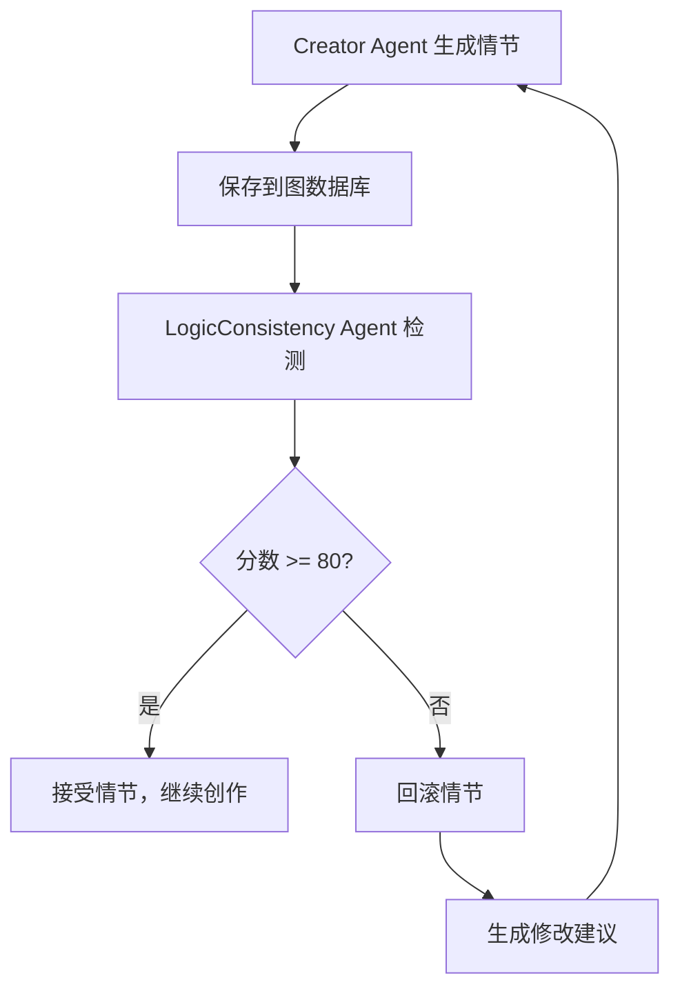

# 逻辑一致性检测 Agent 使用指南

## 概述

LogicConsistencyAgent 是一个基于图数据库的剧本逻辑一致性检测 Agent，它通过执行 Cypher 查询来审计剧本中的逻辑矛盾和冲突。

## 核心功能

### 审计规则

| 规则 ID | 名称 | 描述 | 严重程度 |
|---------|------|------|----------|
| `spatiotemporal` | 时空冲突检测 | 同一时间点，同一角色不能出现在两个地点 | CRITICAL |
| `character_status` | 角色状态检测 | 已死亡角色不能有后续行动 | CRITICAL |
| `motivation` | 动机缺失检测 | 重大事件需要有动机支持 | HIGH |
| `relationship` | 关系一致性检测 | 社交关系变化需要合理过渡 | MEDIUM |
| `knowledge` | 知识连续性检测 | 角色能力/记忆保持一致 | MEDIUM |
| `world_rule` | 世界观冲突检测 | 情节不能违反世界观规则 | HIGH |
| `plot_coherence` | 情节连贯性检测 | 相邻情节应有因果关系 | LOW |

### 评分系统

- **基础分数**: 100 分
- **扣分规则**:
  - CRITICAL: -25 分
  - HIGH: -15 分
  - MEDIUM: -8 分
  - LOW: -3 分
- **通过标准**: >= 80 分
- **严重阈值**: < 60 分（会触发回滚建议）

## 快速开始

### 1. 直接使用 Agent

```python
import logging
from agents.logic_consistency_agent import LogicConsistencyAgent

logger = logging.getLogger(__name__)

# 初始化 Agent
agent = LogicConsistencyAgent()

# 准备请求数据
request_data = {
    "story_id": "story_001",
    "scan_depth": "all",
    "check_rules": ["spatiotemporal", "character_status", "motivation"],
}

# 执行检测
async for event in agent.process_request(request_data):
    if event["event_type"] == "tool_complete":
        result = event["data"]["result"]
        logger.info(f"分数: {result['score']}")
        logger.info(f"通过: {result['passed']}")
        logger.info(f"问题数: {result['issue_count']}")
```

### 2. 在工作流中集成

```python
import logging
from examples.workflow_with_consistency_check import (
    CreativeWorkflowWithConsistencyCheck
)

logger = logging.getLogger(__name__)

# 创建工作流
workflow = CreativeWorkflowWithConsistencyCheck()
await workflow.initialize()

# 创建情节并自动验证
async for event in workflow.create_plot_with_validation(
    story_id="story_001",
    plot_data=plot_data,
):
    if event["event_type"] == "rollback_suggested":
        # 处理回滚建议
        logger.info(f"需要回滚，原因: {event['data']['recommendations']}")
    elif event["event_type"] == "tool_complete":
        logger.info(f"完成: {event['data']['message']}")
```

### 3. 通过 API 调用

```bash
# 执行一致性检测
curl -X POST "http://localhost:8000/logic-consistency/check" \
  -H "Content-Type: application/json" \
  -d '{
    "story_id": "story_001",
    "scan_depth": "all",
    "check_rules": ["spatiotemporal", "character_status"],
    "auto_rollback": false
  }'

# 获取审计规则列表
curl -X GET "http://localhost:8000/logic-consistency/rules"

# 获取评分规则
curl -X GET "http://localhost:8000/logic-consistency/scoring"
```

## 检测结果示例

```json
{
  "success": true,
  "story_id": "story_001",
  "scan_time": "2025-02-08T10:30:00Z",
  "overall_score": 62.5,
  "passed": false,
  "issue_count": 3,
  "critical_issues": 2,
  "high_issues": 1,
  "medium_issues": 0,
  "low_issues": 0,
  "rollback_required": true,
  "report_text": "# 剧本逻辑一致性检测报告\n\n..."
}
```

## 完整工作流程



## 审计规则详解

### 1. 时空冲突检测

**Cypher 查询**:
```cypher
MATCH (c:Character {story_id: $story_id})
MATCH (c)-[:INVOLVED_IN]->(p1:PlotNode)
MATCH (c)-[:INVOLVED_IN]->(p2:PlotNode)
WHERE p1.sequence_number = p2.sequence_number
  AND p1.location <> p2.location
RETURN c, p1, p2
```

**检测逻辑**:
- 查找同一角色的所有参与情节
- 检查同一序列号是否有不同地点
- 返回冲突列表

### 2. 角色状态检测

**Cypher 查询**:
```cypher
MATCH (c:Character {story_id: $story_id})
WHERE c.status = 'deceased'
MATCH (c)-[:INVOLVED_IN]->(death_plot)
WITH c, min(death_plot.sequence_number) AS death_seq
MATCH (c)-[:INVOLVED_IN]->(after_plot)
WHERE after_plot.sequence_number > death_seq
RETURN c, death_seq, collect(after_plot)
```

**检测逻辑**:
- 查找状态为 "deceased" 的角色
- 确定死亡位置的序列号
- 查找死亡之后的所有行动
- 返回冲突列表

### 3. 动机缺失检测

**Cypher 查询**:
```cypher
MATCH (p:PlotNode)
WHERE p.importance >= 80
MATCH (p)-[:INVOLVED_IN]-(c:Character)
OPTIONAL MATCH (c)-[:DRIVEN_BY]->(motivation)
WITH c, count(motivation) AS motivation_count
WHERE motivation_count = 0
RETURN p, collect(c)
```

**检测逻辑**:
- 查找重要性 >= 80 的情节
- 查找参与的角色
- 检查每个角色是否有动机连接
- 返回缺乏动机的角色和情节

## 回滚机制

当检测分数 < 80 时，系统会：

1. **触发回滚建议**
   ```json
   {
     "event_type": "rollback_suggested",
     "data": {
       "reason": "逻辑一致性检测未通过",
       "score": 62.5,
       "threshold": 80.0,
       "critical_issues": 2
     }
   }
   ```

2. **执行回滚操作**
   - 从图数据库删除未通过的情节
   - 恢复到上一个快照（如果有）
   - 生成修改建议

3. **重新生成**
   - 将修改建议反馈给 Creator Agent
   - Creator Agent 根据建议重新生成
   - 重新执行检测

## 最佳实践

1. **在关键步骤检测**
   - 每完成一章内容后检测
   - 重要情节转折点检测
   - 角色状态变化时检测

2. **分阶段检测**
   ```python
   # 粗检测：只检测严重问题
   await check_with_rules(["spatiotemporal", "character_status"])

   # 完整检测：检测所有规则
   await check_with_rules(["all"])
   ```

3. **设置合理的阈值**
   ```python
   # 开发阶段：降低阈值，发现更多问题
   agent.passing_score = 70.0

   # 生产阶段：提高阈值，确保质量
   agent.passing_score = 85.0
   ```

4. **结合人工审核**
   - 自动检测后，输出报告
   - 人工审核建议
   - 决定是否应用修复

## 故障排查

### 问题：检测失败，无结果返回

**可能原因**:
- 图数据库未初始化
- 故事 ID 不存在
- 节点或关系缺失

**解决方案**:
```python
# 检查图数据库连接
from utils.graph_manager import get_graph_manager
graph_manager = await get_graph_manager()
is_connected = await graph_manager.verify_connectivity()
print(f"连接状态: {is_connected}")

# 检查故事数据
stats = await graph_manager.get_story_statistics("story_001")
print(f"统计: {stats}")
```

### 问题：误报率高

**解决方案**:
- 调整置信度阈值
- 添加例外情况到图数据库
- 完善情节元数据（location, characters_involved 等）

### 问题：性能问题

**解决方案**:
- 使用 `scan_depth: "recent"` 只检测最近情节
- 只检测关键规则
- 增加图数据库索引

## 高级用法

### 自定义检测规则

```python
class CustomLogicAgent(LogicConsistencyAgent):
    async def _check_custom_rule(self, graph_manager, story_id):
        """自定义检测规则"""
        query = """
        MATCH (p:PlotNode {story_id: $story_id})
        WHERE p.description CONTAINS '魔法'
        RETURN p
        """
        # 执行查询并返回问题
        ...
```

### 集成到 Agent 工作流

```python
class MyCreativeAgent(BaseJubenAgent):
    def __init__(self):
        super().__init__("my_creative_agent")
        self.consistency_agent = LogicConsistencyAgent()

    async def process_request(self, request_data, context):
        # 生成内容
        generated_content = await self._generate_content()

        # 保存到图数据库
        await self._save_to_graph(generated_content)

        # 一致性检测
        check_result = await self._check_consistency()

        if not check_result["passed"]:
            # 生成修正版本
            corrected_content = await self._correct_content(
                generated_content,
                check_result["issues"]
            )
            yield corrected_content
        else:
            yield generated_content
```

## 相关文档

- [图数据库使用指南](./GRAPH_DATABASE_GUIDE.md)
- [图数据库集成指南](./GRAPH_INTEGRATION.md)
- [Agent 开发指南](./AGENT_DEVELOPMENT.md)
