# 业务流程说明

## 业务流程概述

剧本创作 Agent 平台的核心业务流程包括用户交互、Agent执行、工作流编排、知识检索等多个环节。本章节详细描述各核心业务流程的执行逻辑。

## 目录

- [用户交互流程](#用户交互流程)
- [Agent执行流程](#agent执行流程)
- [工作流编排流程](#工作流编排流程)
- [知识检索流程](#知识检索流程)
- [项目管理流程](#项目管理流程)
- [特殊业务流程](#特殊业务流程)

## 用户交互流程

### 主聊天交互流程

**描述**: 用户与短剧策划助手进行完整交互的端到端流程

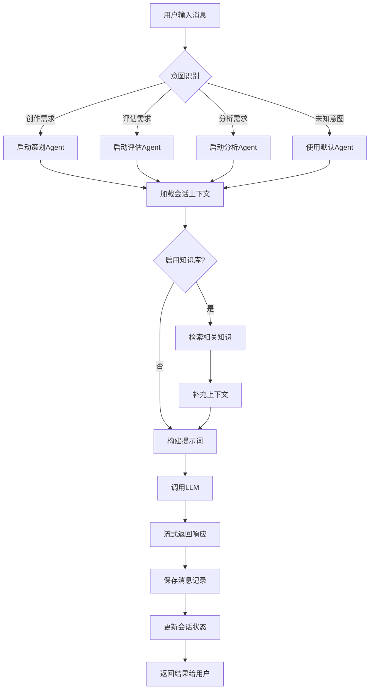

### 调用链路

**入口点**: `apis/core/api_routes.py::chat()`

**调用流程**:

```python
# 1. 请求参数解析与验证
chat_request = ChatRequest(**request_data)

# 2. 获取或创建Agent实例
agent = get_agent_instance(chat_request.agent_id)

# 3. 加载会话上下文
session = await storage_manager.get_session(chat_request.session_id)
history = await storage_manager.get_messages(session_id)

# 4. 知识库检索（可选）
if chat_request.enable_knowledge_base:
    knowledge = await knowledge_client.search(
        query=chat_request.input,
        collection=chat_request.collection,
        top_k=chat_request.top_k
    )

# 5. 构建输入并执行Agent
async for event in agent.process_request({
    "input": chat_request.input,
    "history": history,
    "knowledge": knowledge,
    "user_id": chat_request.user_id
}):
    yield event

# 6. 保存消息记录
await storage_manager.save_message(
    session_id=session.id,
    role="user",
    content=chat_request.input
)
await storage_manager.save_message(
    session_id=session.id,
    role="assistant",
    content=response_content
)
```

### 关键判断点

| 判断点 | 条件 | 处理路径 |
|--------|------|----------|
| 意图识别 | 用户输入包含"策划"、"创作"等关键词 | 路由到ShortDramaPlannerAgent |
| 意图识别 | 用户输入包含"评估"、"打分"等关键词 | 路由到ShortDramaEvaluationAgent |
| 意图识别 | 用户输入包含"分析"、"解读"等关键词 | 路由到分析类Agent |
| 知识库检索 | enable_knowledge_base=true | 执行向量检索并补充上下文 |
| 网络搜索 | enable_web_search=true | 执行网络搜索并补充上下文 |
| 会话存在 | session_id有效 | 加载历史消息 |
| 会话不存在 | session_id为空或无效 | 创建新会话 |

## Agent执行流程

### 标准Agent执行流程

**描述**: 单个Agent处理请求的标准流程

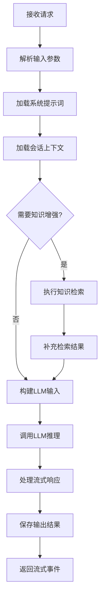

### 执行细节

**代码位置**: `agents/base_juben_agent.py::process_request()`

```python
async def process_request(self, request_data: Dict[str, Any]) -> AsyncGenerator[Dict[str, Any], None]:
    """处理请求的标准流程"""

    # 1. 初始化上下文
    self._current_user_id = request_data.get("user_id")
    self._current_session_id = request_data.get("session_id")

    # 2. 发送思考开始事件
    if self.enable_thought_streaming:
        yield {
            "type": "thought",
            "content": f"{self.agent_name}开始思考...",
            "step_number": 1
        }

    # 3. 构建输入
    messages = await self._build_messages(request_data)

    # 4. 调用LLM
    async for chunk in self._call_llm_stream(messages):
        if chunk.get("content"):
            yield {
                "type": "message",
                "content": chunk["content"],
                "content_type": "text"
            }

    # 5. 发送完成事件
    yield {
        "type": "done",
        "agent_name": self.agent_name,
        "timestamp": datetime.now().isoformat()
    }
```

### Agent分类执行策略

| Agent分类 | 执行策略 | 特殊处理 |
|-----------|----------|----------|
| 策划类 | 单次LLM调用 | 可能需要网络搜索补充 |
| 创作类 | 多轮迭代 | 支持内容扩展和修改 |
| 评估类 | 结构化输出 | 强制JSON格式输出 |
| 分析类 | 分阶段执行 | 先分析后总结 |
| 工作流类 | Agent编排 | 协调多个子Agent |
| 工具类 | 直接处理 | 不涉及LLM调用 |

## 工作流编排流程

### 情节点工作流

**描述**: 大情节点与详细情节点生成工作流

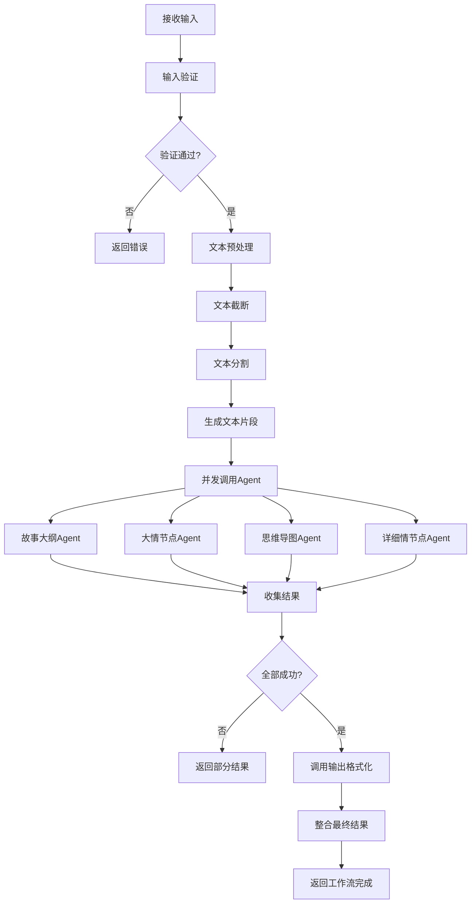

### 并发控制机制

**代码位置**: `workflows/plot_points_workflow.py::_step_agent_coordination()`

```python
async def _step_agent_coordination(self):
    """智能体协调执行（带并发控制）"""

    # 使用信号量限制并发数量
    semaphore = asyncio.Semaphore(self.config.get("agent_concurrency_limit", 4))
    timeout = self.config.get("agent_call_timeout", 300)

    async def call_agent_with_timeout(agent_func, agent_name: str):
        """带超时控制的智能体调用"""
        async with semaphore:
            try:
                return await asyncio.wait_for(agent_func(), timeout=timeout)
            except asyncio.TimeoutError:
                return {"type": agent_name, "error": f"超时({timeout}秒)"}

    # 并行调用各个智能体
    agent_tasks = [
        call_agent_with_timeout(self._call_story_summary_agent, "story_summary"),
        call_agent_with_timeout(self._call_major_plot_points_agent, "major_plot_points"),
        call_agent_with_timeout(self._call_mind_map_agent, "mind_map"),
        call_agent_with_timeout(self._call_detailed_plot_points_agent, "detailed_plot_points")
    ]

    # 等待所有智能体完成
    results = await asyncio.gather(*agent_tasks, return_exceptions=True)
```

### 工作流配置

| 配置项 | 默认值 | 说明 |
|--------|--------|------|
| chunk_size | 10000 | 文本分割块大小 |
| length_size | 50000 | 文本截断长度 |
| parallel_limit | 10 | 并行处理限制 |
| agent_call_timeout | 300 | Agent调用超时（秒） |
| agent_concurrency_limit | 4 | 最大并发Agent数 |

### 关键判断点

| 判断点 | 条件 | 处理路径 |
|--------|------|----------|
| 输入验证 | 缺少input参数 | 返回参数错误 |
| 文本长度 | 超过length_size | 执行截断处理 |
| Agent超时 | 单个Agent执行超过300秒 | 记录错误，继续其他Agent |
| 结果收集 | 至少一个Agent成功 | 继续结果整合 |
| 结果收集 | 全部Agent失败 | 返回工作流失败 |

## 知识检索流程

### RAG知识检索流程

**描述**: 检索剧本创作知识库的完整流程

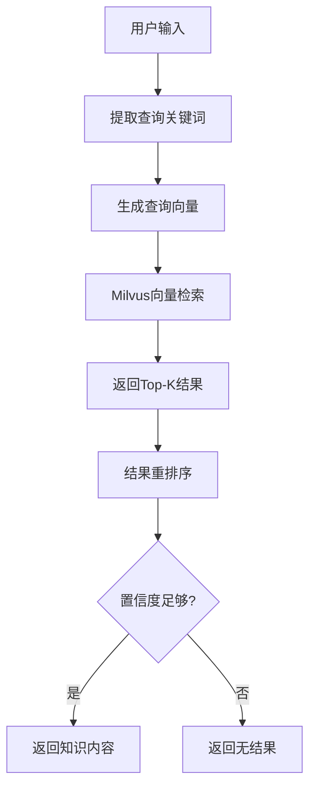

### 检索实现

**代码位置**: `utils/knowledge_base_client.py`

```python
async def search(self, query: str, collection: str, top_k: int = 5):
    """知识库搜索"""

    # 1. 生成查询向量
    embedding = await self._embed_text(query)

    # 2. 向量检索
    results = await self.milvus_client.search(
        collection_name=collection,
        data=[embedding],
        limit=top_k * 2  # 检索更多候选
    )

    # 3. 重排序
    reranked_results = await self._rerank(query, results[0])

    # 4. 返回Top-K
    return reranked_results[:top_k]
```

### BM25+向量混合检索

**代码位置**: `utils/bm25_retriever.py`

```python
async def hybrid_search(self, query: str, top_k: int = 5):
    """混合检索：BM25 + 向量检索"""

    # 1. BM25关键词检索
    bm25_results = self._bm25_search(query, top_k=top_k*2)

    # 2. 向量语义检索
    vector_results = await self._vector_search(query, top_k=top_k*2)

    # 3. 结果融合（RRF算法）
    final_results = self._reciprocal_rank_fusion(
        bm25_results,
        vector_results,
        k=60
    )

    return final_results[:top_k]
```

## 项目管理流程

### 项目创建流程

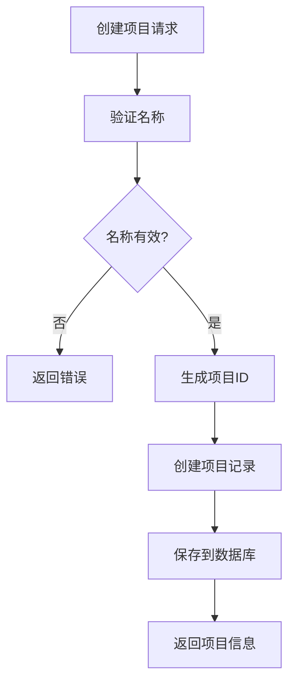

### 文件添加流程

**代码位置**: `apis/projects/api_routes_projects.py::create_project_file()`

```python
async def create_project_file(project_id: str, file_data: ProjectFileCreateRequest):
    """向项目添加文件"""

    # 1. 验证项目存在
    project = await project_manager.get_project(project_id)
    if not project:
        raise HTTPException(404, "项目不存在")

    # 2. 创建文件记录
    file_id = str(uuid.uuid4())
    project_file = ProjectFile(
        id=file_id,
        project_id=project_id,
        filename=file_data.filename,
        file_type=file_data.file_type,
        content=file_data.content,
        agent_source=file_data.agent_source,
        tags=file_data.tags,
        created_at=datetime.now(),
        file_size=len(str(file_data.content))
    )

    # 3. 保存文件
    await project_manager.save_file(project_file)

    # 4. 更新项目文件计数
    await project_manager.update_file_count(project_id)

    return project_file
```

## 特殊业务流程

### 智能意图识别流程

**描述**: 自动识别用户意图并路由到合适的Agent

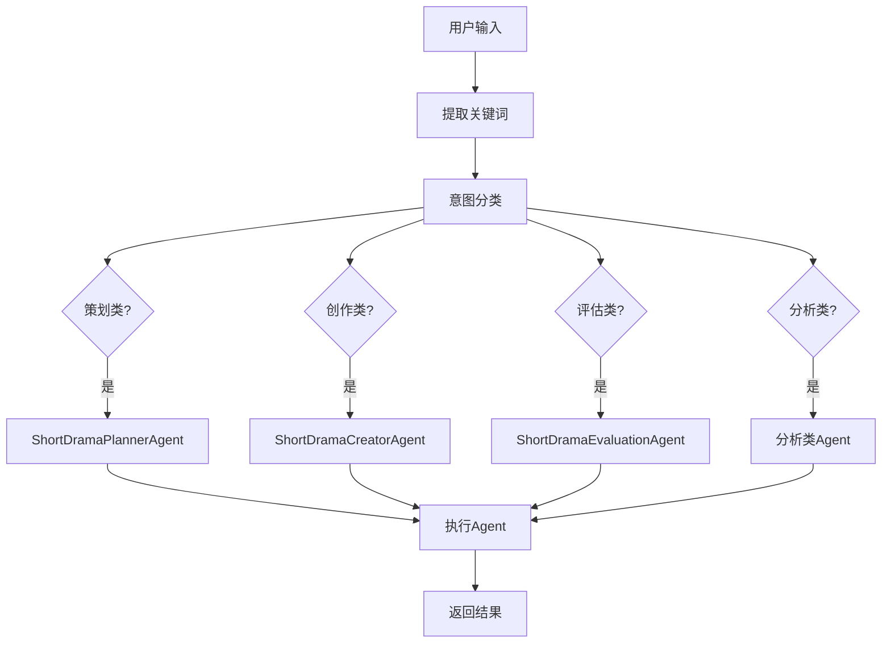

**代码位置**: `utils/intent_recognition.py`

```python
async def recognize_intent(self, user_input: str) -> str:
    """识别用户意图"""

    # 关键词匹配规则
    intent_rules = {
        "planning": ["策划", "规划", "方案", "大纲"],
        "creation": ["创作", "写", "生成", "编写"],
        "evaluation": ["评估", "评价", "打分", "质量"],
        "analysis": ["分析", "解读", "拆解", "研究"]
    }

    # 匹配意图
    for intent, keywords in intent_rules.items():
        if any(kw in user_input for kw in keywords):
            return intent

    # 默认意图
    return "planning"
```

### 思维导图生成流程

**代码位置**: `agents/mind_map_agent.py`

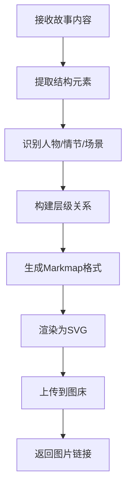

### 网络搜索流程

**代码位置**: `apis/baidu/api_routes_baidu.py`

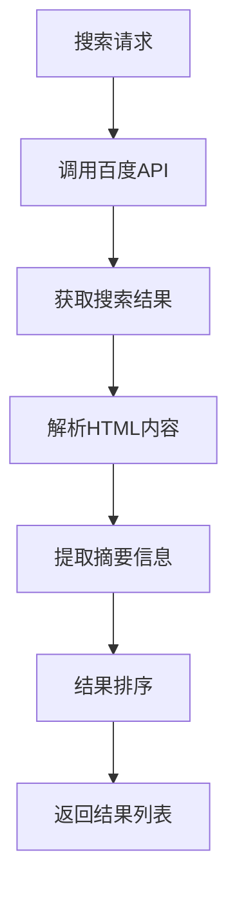

### 人物关系分析流程

**代码位置**: `agents/character_relationship_analyzer_agent.py`

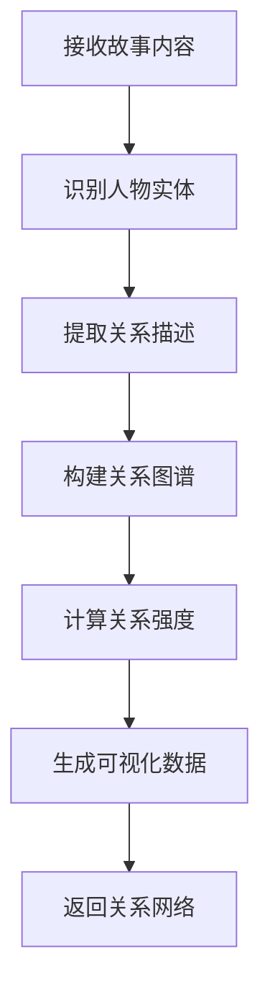

## 错误处理流程

### 统一错误处理

**代码位置**: `utils/error_handler.py`

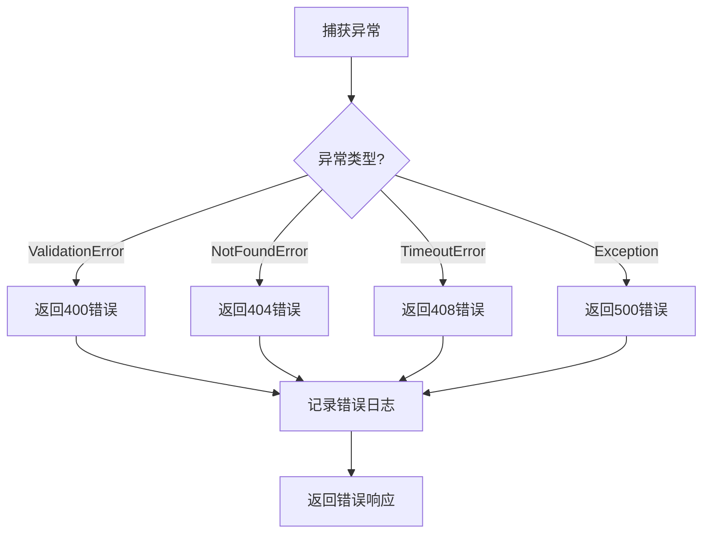

### 重试机制

**代码位置**: `utils/llm_client.py::async_retry()`

```python
@async_retry(max_retries=3, delay=1.0, backoff=2.0)
async def call_llm_with_retry(self, messages: List[Dict]):
    """带重试的LLM调用"""

    # 首次调用
    try:
        return await self.llm_client.ainvoke(messages)
    except Exception as e:
        # 指数退避重试
        # delay * backoff^(attempt-1)
        # 1s -> 2s -> 4s
        raise
```

## 性能优化流程

### 连接池管理

**代码位置**: `utils/connection_pool_manager.py`

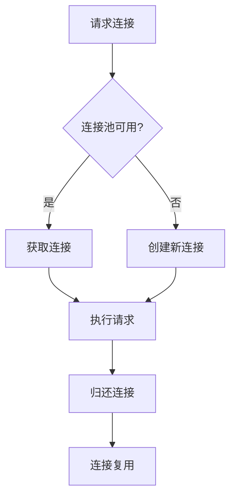

### 多级缓存策略

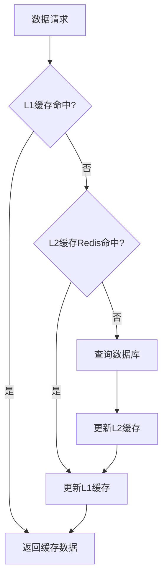

## 相关文档

- [接口文档](./接口文档.md) - API接口说明
- [领域模型说明](./领域模型说明.md) - 数据模型说明
- [项目结构说明](./项目结构说明.md) - 代码组织结构
