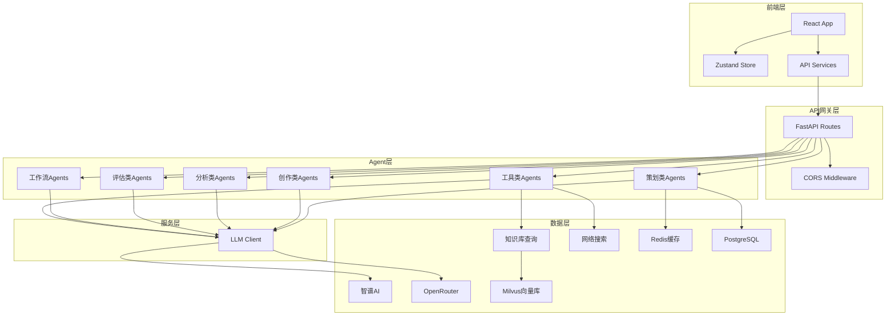

# 项目概述

## 项目背景

**剧本创作 Agent 平台** 是一个专业的短剧策划、创作、评估平台，支持 40+ AI Agents。该项目旨在为短剧制作团队提供全方位的 AI 辅助创作工具，覆盖从创意策划、剧本创作到质量评估的完整工作流程。

随着短剧市场的快速发展，创作者需要高效的工具来提升创作效率和质量。本平台通过集成多个专业化 AI Agent，实现了剧本创作全流程的智能化支持。

## 项目目标

- **提升创作效率**：通过 AI 辅助，大幅缩短剧本策划和创作周期
- **保证内容质量**：多维度评估体系，确保剧本商业价值和观赏性
- **标准化输出**：生成符合行业规范的标准化剧本文档
- **知识沉淀**：构建专业的剧本创作知识库，支持持续学习

## 功能概述

### 核心功能模块

#### 1. 策划类 Agents
- **短剧策划助手** (`ShortDramaPlannerAgent`)：提供剧本策划和创作建议
- **剧本创作助手** (`ShortDramaCreatorAgent`)：生成高质量剧本内容

#### 2. 创作类 Agents
- **人物小传生成** (`CharacterProfileGeneratorAgent`)：为故事人物生成详细小传
- **人物关系分析** (`CharacterRelationshipAnalyzerAgent`)：分析人物关系网络
- **故事大纲生成** (`StorySummaryGeneratorAgent`)：生成精炼的故事大纲
- **思维导图** (`MindMapAgent`)：生成故事结构可视化导图

#### 3. 分析类 Agents
- **故事五元素分析** (`StoryFiveElementsAgent`)：分析人物、情节、环境、主题、风格
- **已播剧集分析** (`SeriesAnalysisAgent`)：分析已播剧集数据和表现
- **剧本深度分析** (`DramaAnalysisAgent`)：对剧本进行深度专业分析
- **故事类型分析** (`StoryTypeAnalyzerAgent`)：识别和分析故事类型

#### 4. 评估类 Agents
- **短剧评估助手** (`ShortDramaEvaluationAgent`)：多维度评估剧本质量
- **剧本评估专家** (`ScriptEvaluationAgent`)：深度剧本分析评估
- **IP价值评估** (`IPEvaluationAgent`)：评估IP商业价值
- **故事质量评估** (`StoryEvaluationAgent`)：评估故事整体质量
- **大纲评估** (`StoryOutlineEvaluationAgent`)：评估大纲完整性和可行性
- **小说筛选评估** (`NovelScreeningEvaluationAgent`)：评估小说改编可行性

#### 5. 工作流 Agents
- **情节点工作流** (`PlotPointsWorkflowAgent`)：完整的情节点生成工作流
- **剧本创作工作流** (`DramaWorkflowAgent`)：端到端剧本创作工作流
- **结果集成器** (`ResultIntegratorAgent`)：集成多个Agent结果

#### 6. 工具类 Agents
- **网络搜索** (`WebSearchAgent`)：实时搜索网络信息
- **知识库查询** (`KnowledgeAgent`)：查询剧本创作知识库
- **文件引用解析** (`FileReferenceAgent`)：解析外部文件内容
- **文本分割/截断** (`TextSplitterAgent`/`TextTruncatorAgent`)：文本处理工具

### 智能特性

- **流式实时交互**：SSE流式输出，打字机效果
- **智能意图识别**：自动识别用户创作意图
- **知识库检索**：专业的剧本创作知识库支持
- **工作流编排**：复杂任务的自动编排和协调

## 技术栈

### 后端技术栈

| 技术/框架 | 版本/说明 | 用途 |
|----------|----------|------|
| Python | 3.11 (Docker) / 3.8+ (本地) | 主要开发语言 |
| FastAPI | 0.104+ | Web框架 |
| Pydantic | 最新 | 数据验证 |
| Uvicorn | 最新 | ASGI服务器 |

### AI/LLM 集成

| 服务商 | 模型 | 用途 |
|--------|------|------|
| 智谱AI | GLM-4-Flash系列 | 主要LLM（8种免费模型） |
| OpenRouter | 多种模型 | 备用LLM服务 |
| OpenAI | GPT系列 | 可选LLM服务 |

### 数据存储

| 技术 | 版本 | 用途 |
|------|------|------|
| PostgreSQL (PostgreSQL) | 最新 | 主数据库 |
| Redis | 7-alpine | 缓存服务 |
| Milvus | v2.4.0 | 向量数据库（RAG） |

### 前端技术栈

| 技术/框架 | 版本 | 用途 |
|----------|------|------|
| React | 18.3.1 | UI框架 |
| TypeScript | 5.4.5 | 类型系统 |
| Vite | 5.2.8 | 构建工具 |
| Tailwind CSS | 3.4.3 | 样式框架 |
| Zustand | 4.5.2 | 状态管理 |
| React Router DOM | 6.22.0 | 路由管理 |
| react-markdown | 9.0.1 | Markdown渲染 |
| highlight.js | 11.9.0 | 代码高亮 |

### 部署技术栈

| 技术 | 版本 | 用途 |
|------|------|------|
| Docker | 最新 | 容器化 |
| Docker Compose | 最新 | 容器编排 |
| Nginx | alpine | 反向代理 |
| Prometheus | latest | 监控 |
| Grafana | latest | 可视化 |

## 架构类型

**非GBF框架项目**，采用现代微服务架构：

- **前后端分离**：React前端 + FastAPI后端
- **Agent-as-a-Tool**：模块化Agent设计，支持灵活组合
- **流式响应**：SSE实时流式输出
- **多层缓存**：Redis + 内存缓存，提升响应速度
- **向量检索**：Milvus支持RAG知识库检索

### 架构特点

## 项目亮点

1. **40+ 专业AI Agents**：覆盖剧本创作全流程
2. **黑白极简设计**：专业生产级UI，去除一切不必要装饰
3. **智能工作流编排**：Agent间模块化协作，上下文隔离
4. **多模型支持**：智谱AI 8种免费模型，灵活切换
5. **生产级部署**：完整的Docker化部署方案
6. **监控完善**：Prometheus + Grafana监控体系

## 相关文档

- [领域模型说明](./领域模型说明.md) - 核心数据模型和实体关系
- [接口文档](./接口文档.md) - API接口详细说明
- [业务流程说明](./业务流程说明.md) - 核心业务流程
- [项目结构说明](./项目结构说明.md) - 代码组织结构
- [外部依赖说明](./外部依赖说明.md) - 外部服务依赖
