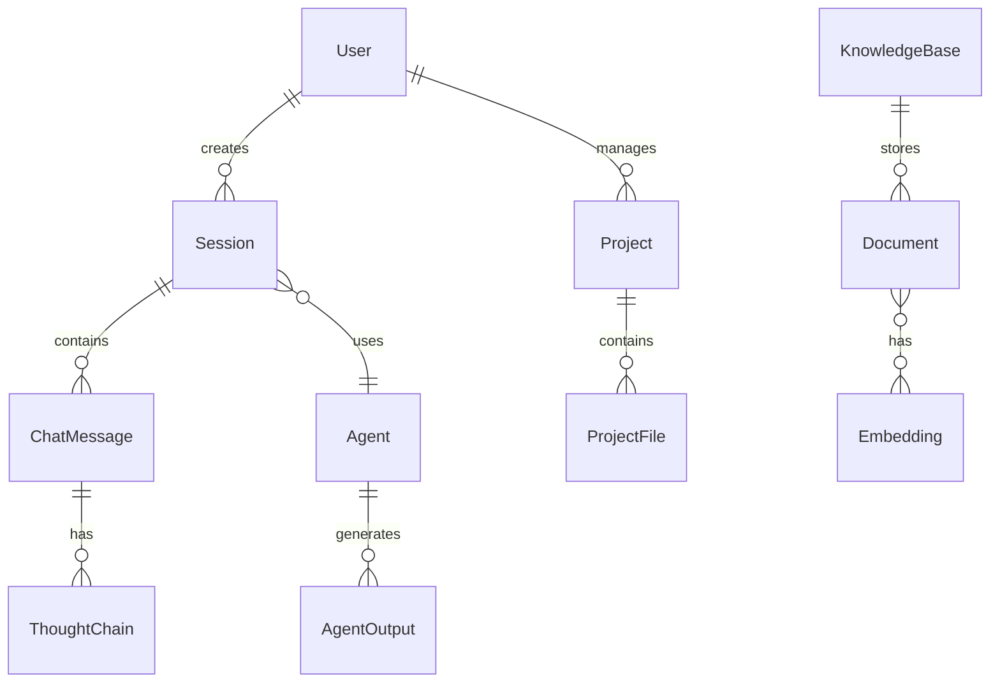
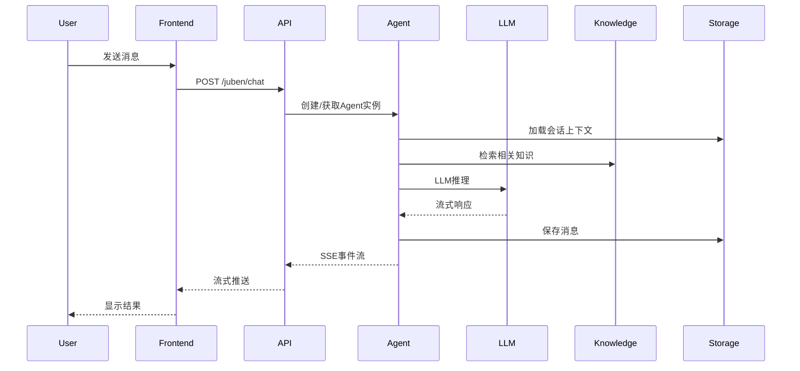
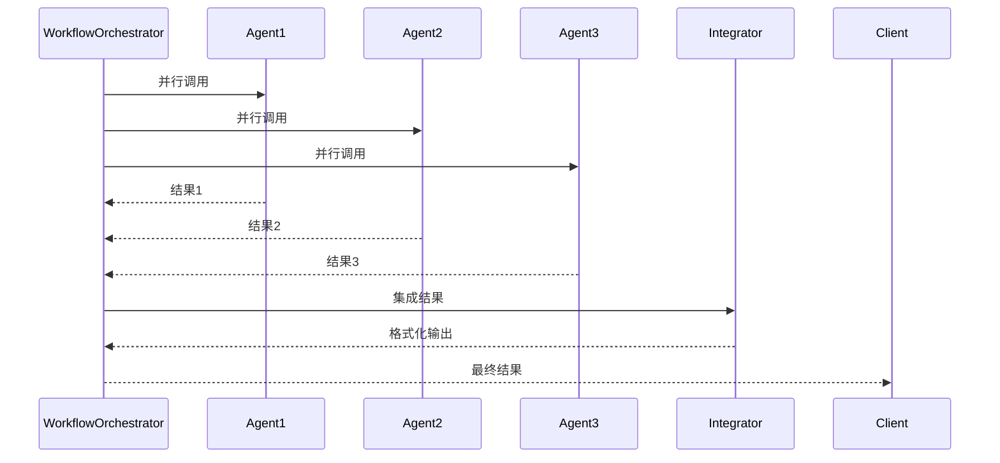

# 领域模型说明

## 领域模型概述

剧本创作 Agent 平台的领域模型围绕 **剧本创作** 这一核心业务领域构建，涵盖策划、创作、分析、评估等全流程。核心业务概念包括：

- **Agent（智能体）**：执行特定创作任务的专业AI模块
- **会话（Session）**：用户与Agent的交互上下文
- **消息（Message）**：用户输入与AI响应的交互单元
- **项目（Project）**：组织创作成果的业务实体
- **知识库（Knowledge Base）**：剧本创作专业知识存储

## 核心实体关系图



## 核心实体详细说明

### 1. Agent（智能体）

智能体是平台的核心执行单元，每个Agent负责特定的创作任务。

#### 实体属性

| 属性名 | 类型 | 说明 | 约束 |
|--------|------|------|------|
| id | str | Agent唯一标识 | 格式: `{category}_{function}` |
| name | str | Agent类名 | 对应Python类名 |
| display_name | str | 显示名称 | 用户界面显示 |
| description | str | 功能描述 | 简要说明功能 |
| category | str | 分类 | planning/creation/evaluation/analysis/workflow/character/story/utility |
| icon | str | 图标 | Emoji标识 |
| model | str | 默认模型 | glm-4-flash/glm-4.7-flash/glm-4.1v-thinking-flash |
| api_endpoint | str | API端点 | `/juben/...` |
| features | List[str] | 功能列表 | 特性描述 |
| capabilities | List[str] | 能力列表 | 具体能力描述 |
| status | str | 运行状态 | active/beta/deprecated |
| examples | List[str] | 使用示例 | 示例对话 |

#### 业务规则

- Agent ID必须唯一，格式为 `{category}_{function}`
- 每个Agent必须归属于一个分类
- Agent状态管理：active（活跃）、beta（测试）、deprecated（废弃）
- Agent调用需经过权限验证和限流控制

#### 代码示例

```python
# apis/core/api_routes.py:73-86
{
    "id": "short_drama_planner",
    "name": "ShortDramaPlannerAgent",
    "display_name": "短剧策划助手",
    "description": "专业的短剧策划和创作建议助手",
    "category": "planning",
    "icon": "📋",
    "model": "glm-4-flash",
    "api_endpoint": "/juben/chat",
    "features": ["剧本策划", "情节设计建议", "结构优化", "创作指导"],
    "status": "active"
}
```

### 2. ChatMessage（聊天消息）

聊天消息记录用户与Agent的交互内容。

#### 实体属性

| 属性名 | 类型 | 说明 | 约束 |
|--------|------|------|------|
| id | str | 消息唯一标识 | UUID格式 |
| session_id | str | 所属会话ID | 外键 |
| role | str | 角色类型 | user/assistant/system |
| content | str | 消息内容 | Markdown格式 |
| timestamp | datetime | 时间戳 | ISO 8601格式 |
| metadata | Dict | 元数据 | 扩展信息 |
| token_usage | Dict | Token使用 | prompt_tokens/completion_tokens |

#### 业务规则

- 消息按时间顺序存储，支持上下文回溯
- 消息内容支持Markdown格式
- 系统消息用于注入系统提示词
- Token统计用于成本计算

### 3. Session（会话）

会话表示一次完整的用户交互上下文。

#### 实体属性

| 属性名 | 类型 | 说明 | 约束 |
|--------|------|------|------|
| id | str | 会话唯一标识 | UUID格式 |
| user_id | str | 用户ID | 默认: "default_user" |
| agent_id | str | 使用的Agent ID | 外键 |
| created_at | datetime | 创建时间 | 自动生成 |
| updated_at | datetime | 更新时间 | 自动更新 |
| status | str | 会话状态 | active/archived |
| context | Dict | 上下文数据 | 会话状态 |

#### 业务规则

- 会话具有时效性，默认超时时间24小时
- 会话上下文支持滚动窗口管理
- 会话可关联到项目进行成果归集

### 4. Project（项目）

项目用于组织和管理用户的所有创作成果。

#### 实体属性

| 属性名 | 类型 | 说明 | 约束 |
|--------|------|------|------|
| id | str | 项目唯一ID | UUID格式 |
| name | str | 项目名称 | 1-200字符 |
| description | str | 项目描述 | 可选 |
| user_id | str | 用户ID | 必填 |
| created_at | datetime | 创建时间 | 自动生成 |
| updated_at | datetime | 更新时间 | 自动更新 |
| status | ProjectStatus | 项目状态 | ACTIVE/ARCHIVED/DELETED/COMPLETED |
| tags | List[str] | 标签列表 | 用于分类检索 |
| metadata | Dict | 元数据 | 扩展信息 |
| file_count | int | 文件数量 | 统计值 |

#### 项目状态枚举

```python
class ProjectStatus(str, Enum):
    ACTIVE = "active"           # 活跃项目
    ARCHIVED = "archived"       # 已归档
    DELETED = "deleted"         # 已删除
    COMPLETED = "completed"     # 已完成
```

#### 业务规则

- 项目必须关联到用户
- 项目状态转换：ACTIVE → ARCHIVED → DELETED
- 项目标签用于搜索和分类
- 删除项目时保留30天后可永久删除

#### 代码示例

```python
# apis/core/schemas.py:232-243
class Project(BaseModel):
    """项目模型"""
    id: str = Field(description="项目唯一ID")
    name: str = Field(description="项目名称")
    description: Optional[str] = Field(default="", description="项目描述")
    user_id: str = Field(description="用户ID")
    created_at: datetime = Field(description="创建时间")
    updated_at: datetime = Field(description="更新时间")
    status: ProjectStatus = Field(default=ProjectStatus.ACTIVE, description="项目状态")
    tags: List[str] = Field(default_factory=list, description="标签列表")
    metadata: Dict[str, Any] = Field(default_factory=dict, description="元数据")
    file_count: int = Field(default=0, description="文件数量")
```

### 5. ProjectFile（项目文件）

项目文件表示项目中的创作成果。

#### 实体属性

| 属性名 | 类型 | 说明 | 约束 |
|--------|------|------|------|
| id | str | 文件ID | UUID格式 |
| project_id | str | 所属项目ID | 外键 |
| filename | str | 文件名 | 必填 |
| file_type | FileType | 文件类型 | 枚举值 |
| agent_source | str | 来源Agent | 可选 |
| content | Any | 文件内容 | 动态类型 |
| tags | List[str] | 标签列表 | 用于分类 |
| created_at | datetime | 创建时间 | 自动生成 |
| updated_at | datetime | 更新时间 | 自动更新 |
| file_size | int | 文件大小 | 字节数 |
| version | int | 版本号 | 默认1 |

#### 文件类型枚举

```python
class FileType(str, Enum):
    CONVERSATION = "conversation"         # 对话记录
    DRAMA_PLANNING = "drama_planning"     # 剧本策划
    CHARACTER_PROFILE = "character_profile"  # 人物小传
    SCRIPT = "script"                     # 剧本
    PLOT_POINTS = "plot_points"           # 情节点
    EVALUATION = "evaluation"             # 评估
    NOTE = "note"                         # 笔记
    REFERENCE = "reference"               # 参考资料
    EXPORT = "export"                     # 导出文件
    OTHER = "other"                       # 其他
```

### 6. StreamEvent（流式事件）

流式事件用于SSE实时推送。

#### 实体属性

| 属性名 | 类型 | 说明 | 约束 |
|--------|------|------|------|
| event_type | EventType | 事件类型 | 枚举值 |
| content | str | 事件内容 | 可选 |
| content_type | ContentType | 内容类型 | TEXT/MARKDOWN/JSON/HTML |
| metadata | Dict | 元数据 | 扩展信息 |
| timestamp | str | 时间戳 | ISO 8601格式 |

#### 事件类型枚举

```python
class EventType(str, Enum):
    MESSAGE = "message"       # 消息事件
    THOUGHT = "thought"       # 思考过程
    TOOL = "tool"             # 工具调用
    ERROR = "error"           # 错误事件
    DONE = "done"             # 完成事件
    BILLING = "billing"       # 计费信息
```

### 7. ThoughtChain（思考链）

思考链记录Agent的推理过程。

#### 实体属性

| 属性名 | 类型 | 说明 |
|--------|------|------|
| steps | List[ThoughtStep] | 思考步骤列表 |
| current_step | int | 当前步骤 |
| status | str | 状态 |

#### 思考步骤

| 属性名 | 类型 | 说明 |
|--------|------|------|
| step_number | int | 步骤编号 |
| description | str | 步骤描述 |
| content | str | 步骤内容 |
| timestamp | datetime | 时间戳 |

## 实体关系说明

### Agent 与 Session

- **关系类型**：一对多
- **说明**：一个Agent可以处理多个会话
- **约束**：会话必须关联到一个Agent

### Session 与 ChatMessage

- **关系类型**：一对多
- **说明**：一个会话包含多条消息
- **约束**：消息按时间顺序存储

### User 与 Project

- **关系类型**：一对多
- **说明**：一个用户可以创建多个项目
- **约束**：项目必须关联到用户

### Project 与 ProjectFile

- **关系类型**：一对多
- **说明**：一个项目包含多个文件
- **约束**：文件必须属于一个项目

### Agent 与 AgentOutput

- **关系类型**：一对多
- **说明**：Agent产生多个输出
- **约束**：输出记录Agent的执行结果

## 数据流转关系

### 请求处理流程



### Agent协作流程



## 领域服务

### 1. IntentRecognitionService（意图识别服务）

识别用户输入的创作意图，自动路由到合适的Agent。

### 2. KnowledgeRetrievalService（知识检索服务）

基于向量相似度检索相关剧本创作知识。

### 3. ProjectManagementService（项目管理服务）

管理用户项目的创建、更新、归档。

### 4. StorageManagementService（存储管理服务）

管理聊天消息、Agent输出、Notes的存储。

### 5. WorkflowOrchestrationService（工作流编排服务）

协调多个Agent协作完成复杂任务。

## 相关文档

- [接口文档](./接口文档.md) - API接口详细说明
- [业务流程说明](./业务流程说明.md) - 核心业务流程
- [项目结构说明](./项目结构说明.md) - 代码组织结构
