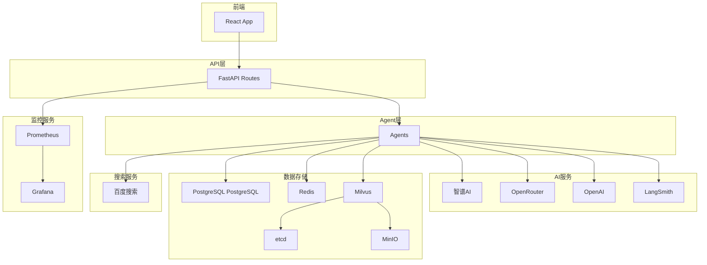

# 外部依赖说明

## 外部依赖概述

剧本创作 Agent 平台依赖多个外部服务，包括AI模型服务、数据存储服务、搜索服务等。本章节详细说明各项外部依赖的用途、调用关系和配置方式。

## 目录

- [AI服务依赖](#ai服务依赖)
- [数据存储依赖](#数据存储依赖)
- [搜索服务依赖](#搜索服务依赖)
- [监控服务依赖](#监控服务依赖)
- [调用关系图](#调用关系图)
- [依赖配置](#依赖配置)

## AI服务依赖

### 1. 智谱AI（主要LLM服务）

**服务提供商**: 智谱AI (Zhipu AI)

**服务地址**: https://open.bigmodel.cn/

**用途**:
- 主要的LLM推理服务
- 提供多种免费模型支持

**支持的模型**:

| 模型名称 | 类型 | 上下文长度 | 用途 |
|----------|------|-----------|------|
| glm-4-flash | 文本生成 | 128K | 默认快速模型 |
| glm-4.7-flash | 文本生成 | 128K | 高性能模型 |
| glm-4-air | 文本生成 | 128K | 轻量模型 |
| glm-4-airx | 文本生成 | 128K | 超轻量模型 |
| glm-4-flashx | 文本生成 | 128K | 超快速模型 |
| glm-4.1v-thinking-flash | 思维链 | 128K | 复杂推理 |
| cogview-3-plus | 图像生成 | - | 图片生成 |
| cogvideox | 视频生成 | - | 视频生成 |

**配置方式**:

```bash
# .env文件
ZHIPU_API_KEY=your_api_key_here
```

**代码位置**: `utils/llm_client.py`

**调用示例**:
```python
from utils.llm_client import LLMClient

client = LLMClient(provider="zhipu", model="glm-4-flash")
response = await client.generate("你好")
```

**重试策略**:
- 最大重试次数: 3次
- 初始延迟: 1秒
- 退避倍数: 2倍
- 超时时间: 300秒

### 2. OpenRouter（备用LLM服务）

**服务提供商**: OpenRouter

**服务地址**: https://openrouter.ai/

**用途**:
- 备用LLM服务
- 提供多种模型选择

**配置方式**:
```bash
OPENROUTER_API_KEY=your_api_key_here
```

### 3. OpenAI（可选LLM服务）

**服务提供商**: OpenAI

**服务地址**: https://api.openai.com/

**用途**:
- 可选的GPT模型支持

**配置方式**:
```bash
OPENAI_API_KEY=your_api_key_here
```

### 4. LangSmith（LLM追踪）

**服务提供商**: LangChain

**服务地址**: https://smith.langchain.com/

**用途**:
- LLM调用追踪和监控
- Prompt调试和优化

**配置方式**:
```bash
LANGCHAIN_API_KEY=your_api_key_here
LANGCHAIN_PROJECT=juben-drama-planner
```

**代码位置**: `utils/langsmith_client.py`

## 数据存储依赖

### 1. PostgreSQL PostgreSQL（主数据库）

**服务提供商**: PostgreSQL

**服务地址**: https://postgresql.com/

**用途**:
- 存储用户数据
- 存储项目信息
- 存储聊天历史
- 存储Agent输出

**数据表**:

| 表名 | 说明 |
|------|------|
| users | 用户信息 |
| projects | 项目信息 |
| project_files | 项目文件 |
| sessions | 会话记录 |
| messages | 聊天消息 |
| agent_outputs | Agent输出 |
| notes | Notes数据 |

**配置方式**:
```bash
POSTGRES_HOST=localhost
POSTGRES_PORT=5432
POSTGRES_DB=juben
POSTGRES_USER=juben
POSTGRES_PASSWORD=change_this_postgres_password
POSTGRES_SSLMODE=disable
```

**代码位置**: `utils/storage_manager.py`

**调用示例**:
```python
from utils.storage_manager import get_storage

storage = await get_storage()
await storage.save_message(
    session_id="xxx",
    role="user",
    content="消息内容"
)
```

### 2. Redis（缓存服务）

**服务提供商**: Redis

**服务地址**: 内部部署 (docker-compose)

**用途**:
- 会话缓存
- L1级缓存
- Token计数缓存
- 连接池管理

**缓存策略**:

| 缓存类型 | 过期时间 | 说明 |
|----------|----------|------|
| 会话缓存 | 24小时 | 用户会话状态 |
| 消息缓存 | 1小时 | 聊天消息 |
| Agent实例 | 1小时 | Agent实例池 |
| 向量缓存 | 7天 | 文本向量缓存 |

**配置方式**:
```bash
REDIS_HOST=redis
REDIS_PORT=6379
REDIS_PASSWORD=
REDIS_DB=0
```

**代码位置**: `utils/redis_client.py`, `utils/connection_pool_manager.py`

**Docker配置**:
```yaml
# docker-compose.yml
redis:
  image: redis:7-alpine
  command: redis-server --appendonly yes --maxmemory 512mb --maxmemory-policy allkeys-lru
```

### 3. Milvus（向量数据库）

**服务提供商**: Milvus

**服务地址**: 内部部署 (docker-compose)

**用途**:
- 存储文本向量
- RAG知识库检索
- 语义搜索

**集合（Collections）**:

| 集合名 | 向量维度 | 说明 |
|--------|----------|------|
| script_segments | 1024 | 剧本片段 |
| character_profiles | 1024 | 人物小传 |
| plot_points | 1024 | 情节点 |
| drama_templates | 1024 | 剧本模板 |

**配置方式**:
```bash
MILVUS_HOST=milvus-standalone
MILVUS_PORT=19530
MILVUS_USER=
MILVUS_PASSWORD=
```

**代码位置**: `utils/milvus_client.py`, `utils/knowledge_base_client.py`

**Docker配置**:
```yaml
# docker-compose.yml
milvus-standalone:
  image: milvusdb/milvus:v2.4.0
  depends_on:
    - etcd
    - minio
```

### 4. MinIO（对象存储）

**服务提供商**: MinIO

**服务地址**: 内部部署 (docker-compose)

**用途**:
- Milvus依赖
- 存储向量索引文件

**配置方式**:
```bash
MINIO_ROOT_USER=minioadmin
MINIO_ROOT_PASSWORD=minioadmin
```

### 5. etcd（Milvus依赖）

**服务提供商**: etcd

**服务地址**: 内部部署 (docker-compose)

**用途**:
- Milvus元数据存储

**Docker配置**:
```yaml
etcd:
  image: quay.io/coreos/etcd:v3.5.5
```

## 搜索服务依赖

### 1. 百度搜索API

**服务提供商**: 百度

**服务地址**: https://www.baidu.com/

**用途**:
- 实时网络搜索
- 获取最新资料
- 补充上下文信息

**配置方式**:
```bash
# 无需API Key，使用公开搜索
BAIDU_SEARCH_ENABLED=true
```

**代码位置**: `apis/baidu/api_routes_baidu.py`, `agents/websearch_agent.py`

**调用示例**:
```python
from agents.websearch_agent import WebSearchAgent

agent = WebSearchAgent()
async for event in agent.process_request({
    "input": "短剧创作技巧",
    "count": 5
}):
    print(event)
```

**返回格式**:
```json
{
  "success": true,
  "results": [
    {
      "title": "标题",
      "url": "链接",
      "snippet": "摘要",
      "source": "来源"
    }
  ]
}
```

## 监控服务依赖

### 1. Prometheus（监控指标）

**服务提供商**: Prometheus

**服务地址**: 内部部署 (docker-compose)

**用途**:
- 收集系统指标
- 监控Agent性能
- 追踪LLM调用

**监控指标**:

| 指标名称 | 类型 | 说明 |
|----------|------|------|
| juben_requests_total | Counter | 总请求数 |
| juben_request_duration | Histogram | 请求耗时 |
| juben_llm_tokens_total | Counter | LLM Token数 |
| juben_active_agents | Gauge | 活跃Agent数 |

**配置方式**:
```yaml
# docker-compose.yml
prometheus:
  image: prom/prometheus:latest
  ports:
    - "9090:9090"
```

### 2. Grafana（可视化监控）

**服务提供商**: Grafana

**服务地址**: 内部部署 (docker-compose)

**用途**:
- 可视化监控面板
- 性能分析图表
- 告警配置

**配置方式**:
```yaml
# docker-compose.yml
grafana:
  image: grafana/grafana:latest
  ports:
    - "3000:3000"
  environment:
    - GF_SECURITY_ADMIN_PASSWORD=admin
```

## 调用关系图



## 依赖配置

### 环境变量配置

**位置**: `.env` 文件（项目根目录）

```bash
# ==================== AI服务配置 ====================
# 智谱AI
ZHIPU_API_KEY=your_zhipu_api_key_here

# OpenRouter（可选）
OPENROUTER_API_KEY=your_openrouter_api_key_here

# OpenAI（可选）
OPENAI_API_KEY=your_openai_api_key_here

# LangSmith（可选）
LANGCHAIN_API_KEY=your_langchain_api_key_here
LANGCHAIN_PROJECT=juben-drama-planner

# ==================== 数据库配置 ====================
# PostgreSQL
POSTGRES_HOST=postgres
POSTGRES_PORT=5432
POSTGRES_DB=juben
POSTGRES_USER=juben
POSTGRES_PASSWORD=change_this_postgres_password
POSTGRES_SSLMODE=disable

# Redis
REDIS_HOST=redis
REDIS_PORT=6379
REDIS_PASSWORD=
REDIS_DB=0

# Milvus
MILVUS_HOST=milvus-standalone
MILVUS_PORT=19530
MILVUS_USER=
MILVUS_PASSWORD=

# ==================== 应用配置 ====================
DEBUG=false
LOG_LEVEL=INFO
HOST=0.0.0.0
PORT=8000

# ==================== 功能开关 ====================
ENABLE_WEB_SEARCH=true
ENABLE_KNOWLEDGE_BASE=true
ENABLE_AUTO_RAG=false
ENABLE_SMART_SELECT=false

# ==================== 性能配置 ====================
ENABLE_THOUGHT_STREAMING=true
THOUGHT_MIN_LENGTH=20
THOUGHT_BATCH_SIZE=5
ENABLE_FAST_MODE=false
```

### Docker Compose配置

**位置**: `docker-compose.yml`

```yaml
services:
  # 主应用服务
  juben-api:
    build: .
    ports:
      - "8000:8000"
    environment:
      - ZHIPU_API_KEY=${ZHIPU_API_KEY}
      - POSTGRES_HOST=${POSTGRES_HOST}
      - REDIS_HOST=redis
      - MILVUS_HOST=milvus-standalone
    depends_on:
      - redis
      - milvus-standalone

  # Redis缓存
  redis:
    image: redis:7-alpine

  # Milvus向量库
  milvus-standalone:
    image: milvusdb/milvus:v2.4.0
    depends_on:
      - etcd
      - minio

  # etcd
  etcd:
    image: quay.io/coreos/etcd:v3.5.5

  # MinIO
  minio:
    image: minio/minio:RELEASE.2023-03-20T20-16-18Z

  # Nginx
  nginx:
    image: nginx:alpine

  # 监控
  prometheus:
    image: prom/prometheus:latest

  grafana:
    image: grafana/grafana:latest
```

## 依赖健康检查

### 健康检查端点

| 服务 | 健康检查 | 说明 |
|------|----------|------|
| 主应用 | `GET /health` | 应用健康状态 |
| Redis | `redis-cli ping` | Redis连接 |
| Milvus | `GET http://localhost:9091/healthz` | Milvus状态 |
| MinIO | `GET http://localhost:9000/minio/health/live` | MinIO状态 |
| etcd | `etcdctl endpoint health` | etcd状态 |

### 健康检查配置

```yaml
# docker-compose.yml
services:
  juben-api:
    healthcheck:
      test: ["CMD", "curl", "-f", "http://localhost:8000/health"]
      interval: 30s
      timeout: 10s
      retries: 3

  redis:
    healthcheck:
      test: ["CMD", "redis-cli", "ping"]
      interval: 10s
      timeout: 3s
      retries: 3
```

## 依赖故障处理

### 智谱AI故障

**降级策略**:
1. 自动切换到OpenRouter
2. 如果OpenRouter不可用，切换到OpenAI
3. 记录故障日志

**代码位置**: `utils/llm_client.py`

```python
async def _call_llm_with_fallback(self, messages):
    """带故障转移的LLM调用"""
    try:
        return await self._call_zhipu(messages)
    except Exception as e:
        logger.warning(f"智谱AI调用失败: {e}")
        return await self._call_openrouter(messages)
```

### Redis故障

**降级策略**:
- 直接使用内存缓存
- 降级为无缓存模式

### Milvus故障

**降级策略**:
- 禁用知识库检索
- 使用BM25关键词检索替代

### 百度搜索故障

**降级策略**:
- 禁用网络搜索功能
- 提示用户搜索服务不可用

## 相关文档

- [项目概述](./项目概述.md) - 项目背景
- [接口文档](./接口文档.md) - API接口说明
- [业务流程说明](./业务流程说明.md) - 业务流程
