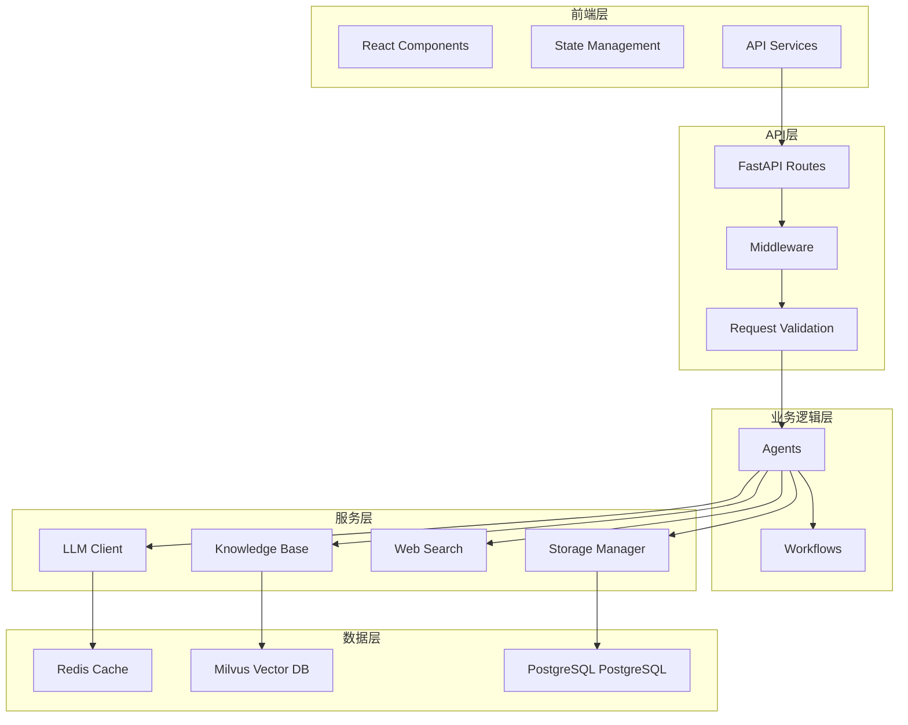
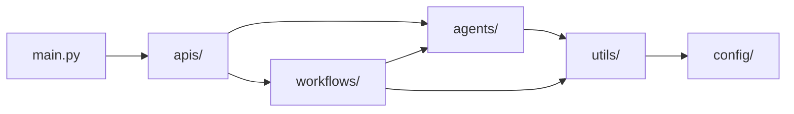

# 项目结构说明

## 项目模块划分

剧本创作 Agent 平台采用典型的前后端分离架构，后端采用分层设计，前端采用组件化架构。

```
juben/
├── agents/              # Agent模块（核心业务逻辑）
├── apis/                # API路由层
├── utils/               # 工具模块
├── workflows/           # 工作流编排
├── middleware/          # 中间件
├── config/              # 配置
├── frontend/            # 前端项目
├── docs/                # 文档
├── tests/               # 测试
├── main.py              # 主入口
├── requirements.txt     # Python依赖
├── docker-compose.yml   # Docker编排
└── Dockerfile           # Docker镜像
```

## 目录结构详解

### 1. agents/ - Agent模块

**职责**: 包含所有AI Agent的实现，是平台的核心业务逻辑层

**关键文件**:

| 文件名 | 说明 |
|--------|------|
| `base_juben_agent.py` | Agent基类，提供通用功能 |
| `short_drama_planner_agent.py` | 短剧策划助手 |
| `short_drama_creator_agent.py` | 短剧创作助手 |
| `short_drama_evaluation_agent.py` | 短剧评估助手 |
| `story_five_elements_agent.py` | 故事五元素分析 |
| `character_profile_generator_agent.py` | 人物小传生成 |
| `character_relationship_analyzer_agent.py` | 人物关系分析 |
| `mind_map_agent.py` | 思维导图生成 |
| `plot_points_workflow_agent.py` | 情节点工作流 |
| `websearch_agent.py` | 网络搜索Agent |
| `knowledge_agent.py` | 知识库查询Agent |

**Agent分类结构**:

```
agents/
├── base_juben_agent.py          # 基类
│
├── 策划类/
│   ├── short_drama_planner_agent.py
│   └── ...
│
├── 创作类/
│   ├── short_drama_creator_agent.py
│   ├── story_summary_generator_agent.py
│   └── ...
│
├── 分析类/
│   ├── story_five_elements_agent.py
│   ├── series_analysis_agent.py
│   ├── drama_analysis_agent.py
│   └── ...
│
├── 评估类/
│   ├── short_drama_evaluation_agent.py
│   ├── script_evaluation_agent.py
│   ├── ip_evaluation_agent.py
│   └── ...
│
├── 工作流类/
│   ├── plot_points_workflow_agent.py
│   ├── drama_workflow_agent.py
│   └── result_integrator_agent.py
│
├── 人物类/
│   ├── character_profile_generator_agent.py
│   └── character_relationship_analyzer_agent.py
│
├── 故事类/
│   ├── major_plot_points_agent.py
│   ├── detailed_plot_points_agent.py
│   └── mind_map_agent.py
│
└── 工具类/
    ├── websearch_agent.py
    ├── knowledge_agent.py
    ├── file_reference_agent.py
    ├── text_splitter_agent.py
    ├── text_truncator_agent.py
    └── ...
```

**BaseJubenAgent核心功能**（`agents/base_juben_agent.py`）:

```python
class BaseJubenAgent(ABC, ContextManagementMixin):
    """
    基础Agent类，提供：
    1. 统一的LLM调用接口
    2. 智谱搜索集成
    3. 知识库检索
    4. 流式输出支持
    5. 错误处理和重试
    6. Token统计
    7. 连接池管理
    8. 性能监控
    9. Notes系统
    10. 智能引用解析
    11. 增强型上下文管理
    """
```

### 2. apis/ - API路由层

**职责**: 处理HTTP请求，协调Agent执行，返回响应

**目录结构**:

```
apis/
├── core/
│   ├── api_routes.py         # 核心API路由（3500+行）
│   └── schemas.py            # 数据模型定义
│
├── agents/
│   └── api_routes_agents.py  # Agents专用API
│
├── baidu/
│   └── api_routes_baidu.py   # 百度搜索API
│
├── tools/
│   └── api_routes_tools.py   # 工具API
│
└── projects/
    └── api_routes_projects.py  # 项目管理API
```

**API路由组织**（`apis/core/api_routes.py`）:

```python
# Agent管理接口
@router.get("/agents/list")              # 获取Agent列表
@router.get("/agents/{agent_id}")        # 获取Agent详情
@router.get("/agents/categories")        # 获取Agent分类
@router.get("/agents/search")            # 搜索Agent

# 聊天交互接口
@router.post("/chat")                    # 主聊天接口
@router.post("/creator/chat")            # 创作助手
@router.post("/evaluation/chat")         # 评估助手
@router.post("/script/evaluation")       # 剧本评估
@router.post("/ip/evaluation")           # IP评估

# 分析接口
@router.post("/story-analysis/analyze")  # 故事五元素分析
@router.post("/series-analysis/analyze") # 已播剧集分析
@router.post("/drama/analysis")          # 剧本深度分析

# 工作流接口
@router.post("/plot-points-workflow/execute")  # 情节点工作流
@router.post("/drama-workflow/execute")        # 剧本创作工作流
```

### 3. utils/ - 工具模块

**职责**: 提供通用工具服务，70+个工具函数

**关键文件**:

| 文件名 | 说明 |
|--------|------|
| `llm_client.py` | LLM客户端，支持智谱AI 8种免费模型 |
| `storage_manager.py` | 存储管理，处理聊天消息、会话 |
| `redis_client.py` | Redis客户端，缓存服务 |
| `milvus_client.py` | Milvus客户端，向量数据库 |
| `knowledge_base_client.py` | 知识库客户端，RAG检索 |
| `intent_recognition.py` | 意图识别，自动路由 |
| `url_extractor.py` | URL提取和解析 |
| `text_processor.py` | 文本处理工具 |
| `bm25_retriever.py` | BM25文本检索 |
| `llm_reranker.py` | 结果重排序 |
| `logger.py` | 日志系统 |
| `error_handler.py` | 错误处理 |
| `performance_monitor.py` | 性能监控 |
| `project_manager.py` | 项目管理器 |
| `enhanced_context_manager.py` | 增强上下文管理 |

**LLM客户端**（`utils/llm_client.py`）:

```python
class LLMClient:
    """
    支持的模型：
    - glm-4-flash: 免费快速模型
    - glm-4.7-flash: 免费高性能模型
    - glm-4-air: 免费轻量模型
    - glm-4-airx: 免费超轻量模型
    - glm-4-flashx: 免费超快速模型
    - glm-4.1v-thinking-flash: 思维模型
    - cogview-3-plus: 图像生成
    - cogvideox: 视频生成
    """
```

### 4. workflows/ - 工作流编排

**职责**: 协调多个Agent协作完成复杂任务

**关键文件**:

| 文件名 | 说明 |
|--------|------|
| `plot_points_workflow.py` | 情节点工作流编排器 |

**工作流编排器**（`workflows/plot_points_workflow.py`）:

```python
class PlotPointsWorkflowOrchestrator:
    """
    大情节点与详细情节点工作流编排器

    功能：
    1. 工作流编排和协调
    2. 智能体间的模块化外包
    3. 上下文隔离管理
    4. 批处理协调
    5. 结果整合和格式化
    """
```

### 5. middleware/ - 中间件

**职责**: 处理HTTP请求的中间件

**文件**:

| 文件名 | 说明 |
|--------|------|
| `cors_middleware.py` | CORS跨域支持 |

### 6. frontend/ - 前端项目

**职责**: React前端应用

**目录结构**:

```
frontend/
├── src/
│   ├── components/       # 组件
│   │   ├── chat/        # 聊天组件
│   │   │   ├── ChatContainer.tsx
│   │   │   ├── ChatMessage.tsx
│   │   │   ├── InputArea.tsx
│   │   │   ├── StreamingText.tsx
│   │   │   └── ThoughtChain.tsx
│   │   ├── common/      # 通用组件
│   │   │   ├── Loading.tsx
│   │   │   ├── Skeleton.tsx
│   │   │   └── MobileMenu.tsx
│   │   ├── layout/      # 布局组件
│   │   │   ├── Header.tsx
│   │   │   └── Sidebar.tsx
│   │   └── modals/      # 模态框
│   │       ├── AgentDetailModal.tsx
│   │       └── SettingsModal.tsx
│   │
│   ├── pages/           # 页面
│   │   ├── MainPage.tsx
│   │   ├── BaiduSearchPage.tsx
│   │   ├── ProjectsPage.tsx
│   │   └── ToolsDemoPage.tsx
│   │
│   ├── services/        # API服务
│   │   ├── api.ts       # 基础API
│   │   ├── chatService.ts  # 聊天服务
│   │   ├── agentService.ts # Agent服务
│   │   ├── projectService.ts # 项目服务
│   │   ├── baiduService.ts  # 百度搜索
│   │   ├── retryService.ts  # 重试服务
│   │   └── extendedApi.ts   # 扩展API
│   │
│   ├── store/           # 状态管理
│   │   ├── chatStore.ts
│   │   ├── agentStore.ts
│   │   ├── settingsStore.ts
│   │   ├── projectStore.ts
│   │   └── uiStore.ts
│   │
│   ├── hooks/           # 自定义Hooks
│   │   ├── useChat.ts
│   │   ├── useAgents.ts
│   │   └── useStream.ts
│   │
│   ├── types/           # TypeScript类型
│   │   └── index.ts
│   │
│   ├── utils/           # 工具函数
│   │   ├── format.ts
│   │   ├── markdown.ts
│   │   ├── streamBuffer.ts
│   │   └── validation.ts
│   │
│   ├── config/          # 配置
│   │   └── agents.ts    # Agent配置
│   │
│   ├── App.tsx          # 应用根组件
│   └── main.tsx         # 入口文件
│
├── index.html           # HTML模板
├── package.json         # 依赖配置
├── vite.config.ts       # Vite配置
├── tailwind.config.js   # Tailwind配置
└── tsconfig.json        # TypeScript配置
```

**前端技术栈**:

- **框架**: React 18.3.1 + TypeScript
- **构建**: Vite 5.2.8
- **状态**: Zustand 4.5.2
- **路由**: React Router DOM 6.22.0
- **样式**: Tailwind CSS 3.4.3
- **Markdown**: react-markdown 9.0.1 + highlight.js

### 7. config/ - 配置

**职责**: 系统配置管理

**文件**:

| 文件名 | 说明 |
|--------|------|
| `settings.py` | 配置定义 |
| `config.yaml` | YAML配置文件 |

### 8. prompts/ - 提示词模板

**职责**: 存储系统提示词模板

### 9. docs/ - 文档

**职责**: 项目文档

## 代码组织结构

### 分层架构



### 包依赖关系



## 关键包说明

### agents包

**职责**: AI Agent实现

**导入示例**:
```python
from agents.short_drama_planner_agent import ShortDramaPlannerAgent
from agents.base_juben_agent import BaseJubenAgent
```

**关键类**:
- `BaseJubenAgent`: Agent基类
- `ShortDramaPlannerAgent`: 短剧策划助手
- `ShortDramaCreatorAgent`: 短剧创作助手
- `ShortDramaEvaluationAgent`: 短剧评估助手

### apis包

**职责**: API路由定义

**导入示例**:
```python
from apis.core.api_routes import router as core_router
from apis.core.schemas import ChatRequest, ChatResponse
```

**关键模块**:
- `apis.core.api_routes`: 核心API路由
- `apis.core.schemas`: 数据模型定义

### utils包

**职责**: 通用工具服务

**导入示例**:
```python
from utils.llm_client import LLMClient
from utils.storage_manager import get_storage
from utils.knowledge_base_client import KnowledgeBaseClient
from utils.intent_recognition import IntentRecognition
```

### workflows包

**职责**: 工作流编排

**导入示例**:
```python
from workflows.plot_points_workflow import PlotPointsWorkflowOrchestrator
```

## 前端代码组织

### 组件结构

```
components/
├── chat/              # 聊天相关组件
│   ├── ChatContainer.tsx       # 聊天容器
│   ├── ChatMessage.tsx         # 消息展示
│   ├── InputArea.tsx           # 输入区域
│   ├── StreamingText.tsx       # 流式文本
│   ├── ThoughtChain.tsx        # 思考链
│   └── MessageActions.tsx      # 消息操作
│
├── layout/            # 布局组件
│   ├── Header.tsx              # 顶部导航
│   ├── Sidebar.tsx             # 侧边栏
│   └── StatusBar.tsx           # 状态栏
│
├── common/            # 通用组件
│   ├── Loading.tsx             # 加载状态
│   ├── Skeleton.tsx            # 骨架屏
│   └── MobileMenu.tsx          # 移动菜单
│
└── modals/            # 模态框
    ├── AgentDetailModal.tsx    # Agent详情
    └── SettingsModal.tsx       # 设置
```

### 状态管理

```typescript
// store/chatStore.ts
interface ChatStore {
  messages: Message[];
  currentAgent: Agent | null;
  isStreaming: boolean;
  // ...
}

// store/agentStore.ts
interface AgentStore {
  agents: Agent[];
  categories: Category[];
  currentCategory: string;
  // ...
}
```

### API服务层

```typescript
// services/chatService.ts
export const chatService = {
  async sendMessage(request: ChatRequest): Promise<AsyncIterator<StreamEvent>> {
    // SSE流式请求
  }
};

// services/agentService.ts
export const agentService = {
  async getAgents(): Promise<Agent[]> {
    // 获取Agent列表
  }
};
```

## 部署相关文件

### Dockerfile

**位置**: `/Dockerfile`

**说明**: Python 3.11基础镜像，包含所有依赖

```dockerfile
FROM python:3.11-slim
WORKDIR /app
COPY requirements.txt .
RUN pip install -r requirements.txt
COPY . .
CMD ["python", "main.py"]
```

### docker-compose.yml

**位置**: `/docker-compose.yml`

**服务**:
- `juben-api`: 主应用服务
- `redis`: 缓存服务
- `milvus-standalone`: 向量数据库
- `etcd`: Milvus依赖
- `minio`: 对象存储
- `nginx`: 反向代理
- `prometheus`: 监控
- `grafana`: 可视化

## 配置文件说明

### requirements.txt

**位置**: `/requirements.txt`

**主要依赖**:
```
fastapi==0.104.*
uvicorn[standard]
pydantic
python-dotenv
httpx
langchain
langsmith
pymilvus
redis
postgresql
```

### package.json

**位置**: `/frontend/package.json`

**主要依赖**:
```json
{
  "dependencies": {
    "react": "^18.3.1",
    "react-dom": "^18.3.1",
    "zustand": "^4.5.2",
    "react-router-dom": "^6.22.0",
    "react-markdown": "^9.0.1"
  }
}
```

## 相关文档

- [项目概述](./项目概述.md) - 项目背景和目标
- [领域模型说明](./领域模型说明.md) - 数据模型说明
- [接口文档](./接口文档.md) - API接口说明
- [外部依赖说明](./外部依赖说明.md) - 外部服务说明
